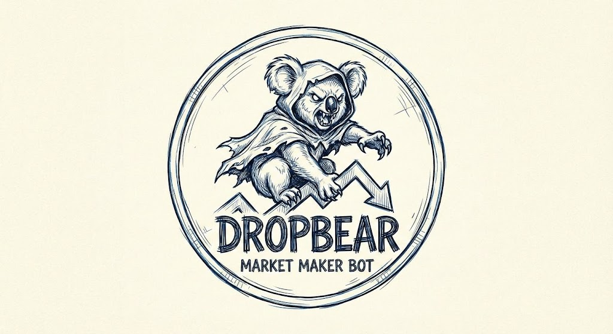

# dropbear

  

Here, in the dense canopy of the order book, we observe one of nature's
most cunning predators. Unlike its docile cousin, the koala, who lounges
about eating eucalyptus and contributing nothing to price discovery, the
dropbear is an apex market taker. It lurks patiently behind the spread
and rips to shreds any dumb liqudiity it can pick off.

This project provides tools for defending yourself from the dropbear, by
being quicker and having better integrated market intelligence.

See [HUMANS.md](HUMANS.md) for further information.
